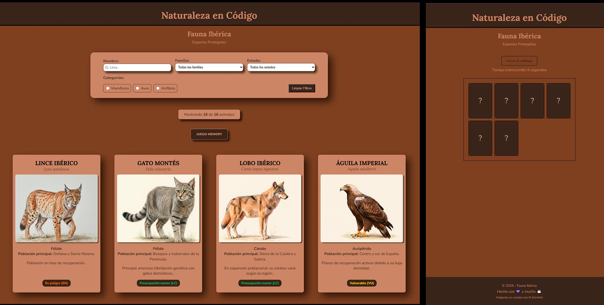

# 🌿 Naturaleza en Código: Fauna Ibérica

Este proyecto ha sido desarrollado como parte del Curso `Fundamentos de JavaScript de Platzi`, aplicando conceptos avanzados de gestión de datos asíncronos y diseño responsivo con CSS moderno. La aplicación permite explorar la biodiversidad de la península, filtrando especies por su estado de conservación, familia y tipo.

## 🚀 Funcionalidades

- **Carga Asíncrona (Fetch):** Los datos no están "hardcodeados"; se consumen desde un archivo externo `./data/data.json`.
- **Sistema de Filtrado Combinado:** Permite buscar por nombre, seleccionar por familia/estado y filtrar por categorías (Checkboxes) de forma simultánea.
- **Contador Dinámico:** Informa al usuario en tiempo real sobre cuántos resultados se muestran del total de la base de datos.
- **Interfaz Reactiva:** Gracias a la pseudo-clase `:has()`, los contenedores de los filtros reaccionan visualmente cuando el input está marcado.
- **Formateo de Datos:** Uso de métodos como `.toUpperCase()` y `.slice()` para normalizar la presentación de los nombres.

## 🎮 Fauna Memory Game

Además del catálogo, he implementado un **juego de memoria interactivo** para poner a prueba tus conocimientos sobre las especies.

- **Progresión de Dificultad:** 4 niveles de dificultad (de 4 a 10 parejas), que escalan dinámicamente según el nivel.
- **Lógica de Estado:** Gestión de partidas mediante contadores de aciertos (`matchedPairs`) y cronómetros controlados (`setInterval`).
- **Persistencia de Datos:** Sistema de récords utilizando `localStorage` para guardar el mejor tiempo por nivel.
- **Interfaz Gamificada:** Tablero generado dinámicamente con CSS Grid, utilizando `auto-fit` para adaptarse a cualquier resolución.

## 🛠️ Tecnologías Utilizadas

### Estructura y Estilo

- **HTML5:** Estructura semántica y formularios accesibles.
- **CSS3:**
  - Layout mediante **Flexbox** y **CSS Grid** para un diseño responsivo.
  - Uso de unidades relativas `rem` para accesibilidad.
  - Selectores modernos como `:has()` para estados reactivos en componentes.

### Lógica y Programación (JavaScript ES6+)

- **Asincronía:** Consumo de datos mediante `fetch` y promesas (`.then`, `.catch`).
- **Manipulación de datos:** Uso de métodos de array (`.filter()`, `.forEach()`) y desestructuración para un código limpio.
- **Dinamismo:** Generación de HTML dinámico mediante **Template Strings** (usando `` `backticks` ``).
- **Manipulación del DOM:** Delegación de eventos (`event.target.closest`) para manejar las cartas y botones eficientemente.
- **Lógica de Estado:** Gestión de volteo (`is-flipped`), comparación de parejas y escalabilidad de niveles.
- **Almacenamiento:** Implementación de `localStorage` para persistencia de récords de tiempo por nivel.

---
